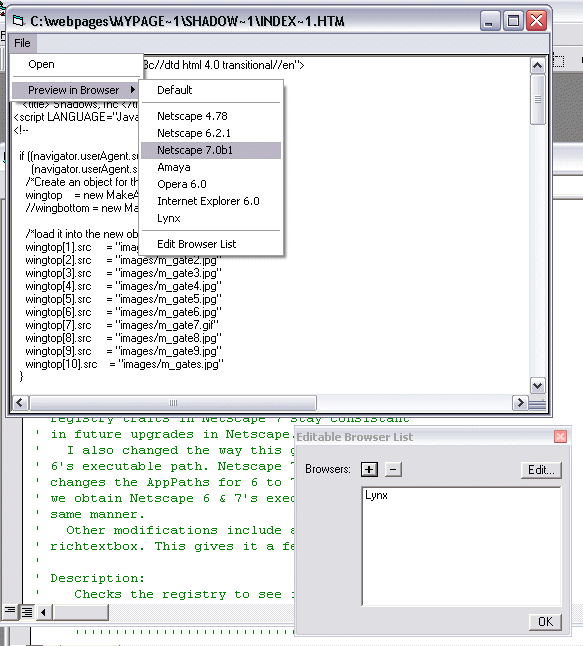



## Previewing with multiple browsers

### Description

This checks the registry to see if certain popular browsers are installed on the machine. If so, it creates registry entries for future reference and lists them in the menu. Just choose the HTML file you want and choose the browser you want to preview the file in. This is simialiar to how Macromedia's DreamWeaver UltraDev 4 retrieves and stores the browsers in the registry. This is great for authors of HTML/CSS/DHTML editors who want to support multiple browser previewing. Tested in WinXP Pro, WinME, Win98 SE, and Win95. Should work in WinNT 4+. Looks for the following Browser types: Netscape (Communicator, 6 (en), and 7), Amaya, Opera, and IE. You can even manually input browsers such as Lynx. **Note** This is an update to my previous submissions.
 
### More Info
 

             |
---                |---
**Submitted On**   |2002-07-11 09:33:08
**By**             |[Michael Heusdens](https://github.com/Planet-Source-Code/PSCIndex/blob/master/ByAuthor/michael-heusdens.md)
**Level**          |Intermediate
**User Rating**    |5.0 (10 globes from 2 users)
**Compatibility**  |VB 6\.0
**Category**       |[Registry](https://github.com/Planet-Source-Code/PSCIndex/blob/master/ByCategory/registry__1-36.md)
**World**          |[Visual Basic](https://github.com/Planet-Source-Code/PSCIndex/blob/master/ByWorld/visual-basic.md)
**Archive File**   |[Previewing1049087112002\.zip](https://github.com/Planet-Source-Code/michael-heusdens-previewing-with-multiple-browsers__1-36806/archive/master.zip)

